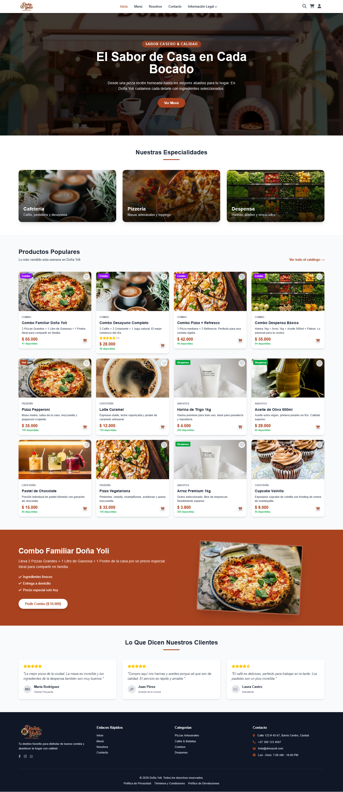

# Doña Yoli - Ecommerce



**Doña Yoli** es una aplicación de comercio electrónico completa para un negocio de cafetería, pizzeria y despensa. Permite a los clientes explorar productos, agregar al carrito, realizar pedidos y gestionar su perfil.

## Características

### Para Clientes
- 🛒 **Catálogo de productos** - Explora productos por categorías (Cafetería, Pizzeria, Despensa, Combos)
- 🔍 **Filtros avanzados** - Busca productos por nombre, categoría, precio y más
- 👁️ **Detalle de producto** - Ver detalles completos y reseñas de cada producto
- ⭐ **Reseñas y ratings** - Califica y revisa productos
- 🛍️ **Carrito de compras** - Agrega productos, modifica cantidades y gestiona tu pedido
- 📦 **Sistema de pedidos** - Solicita entrega a domicilio o recoge en tienda
- 👤 **Gestión de perfil** - Actualiza tus datos y gestiona direcciones de entrega
- 📋 **Historial de pedidos** - Revisa tus pedidos anteriores y su estado
- ❤️ **Favoritos** - Guarda productos para después
- 🔐 **Recuperación de contraseña** - Restablece tu contraseña por email
- 📧 **Contacto** - Envía mensajes al negocio

### Para Administradores
- 📊 **Dashboard** - Visualiza estadísticas de ventas y pedidos recientes
- 👥 **Gestión de usuarios** - Administra usuarios y sus roles
- 🍕 **Gestión de productos** - CRUD completo de productos y categorías
- 📑 **Gestión de pedidos** - Actualiza el estado de los pedidos
- 📝 **Contenido dinámico** - Gestiona testimonios, combos y contenido del sitio
- 📜 **Documentos legales** - Configura términos, privacidad y devoluciones
- ⚙️ **Configuración de pagos** - Configura EnZona y políticas de reembolso

## Tecnologías

### Frontend
- **Angular 21** - Framework principal
- **Tailwind CSS 4** - Estilos
- **TypeScript** - Lenguaje tipado
- **Signals** - Estado reactivo

### Backend
- **Node.js** - Runtime de JavaScript
- **Express.js** - Framework web
- **MongoDB** - Base de datos
- **Mongoose** - ODM
- **JWT** - Autenticación
- **PDFKit** - Generación de facturas
- **QRCode** - Códigos QR para verificación
- **Nodemailer** - Envío de emails

## Estructura del Proyecto

```
├── frontend/                 # Aplicación Angular
│   ├── src/
│   │   ├── app/
│   │   │   ├── core/       # Servicios, interceptores, guards
│   │   │   ├── features/   # Componentes de páginas
│   │   │   └── shared/     # Componentes compartidos
│   │   └── styles.css      # Estilos globales
│   └── angular.json
│
├── backend/                  # API Express
│   ├── src/
│   │   ├── controllers/    # Controladores de rutas
│   │   ├── middleware/     # Middleware de autenticación
│   │   ├── models/         # Modelos de MongoDB
│   │   ├── routes/         # Rutas de la API
│   │   ├── schemas/        # Validación con Zod
│   │   └── config/         # Configuración
│   └── package.json
│
├── Screenshot.png           # Captura de pantalla del proyecto
├── requisitos-funcionales.md
├── requisitos-no-funcionales.md
└── AGENTS.md               # Documentación de desarrollo
```

## Instalación

### Prerequisites
- Node.js 18+
- MongoDB (local o Atlas)
- npm o yarn

### Backend

```bash
cd backend
npm install
# Crear archivo .env con las variables de entorno necesarias
npm run dev
```

El backend estará disponible en `http://localhost:3000`

### Frontend

```bash
cd frontend
npm install
npm start
```

La aplicación estará disponible en `http://localhost:4200`

## Credenciales de Prueba

### Administrador
- Email: `admin@dona-yoli.com`
- Contraseña: `admin123`

## API Endpoints

### Autenticación
| Método | Endpoint | Descripción |
|--------|----------|-------------|
| POST | `/api/auth/register` | Registrar usuario |
| POST | `/api/auth/login` | Iniciar sesión |
| POST | `/api/auth/forgot-password` | Solicitar recuperación de contraseña |
| POST | `/api/auth/reset-password` | Restablecer contraseña |
| GET | `/api/auth/me` | Datos del usuario actual |

### Usuario
| Método | Endpoint | Descripción |
|--------|----------|-------------|
| GET | `/api/users/profile` | Obtener perfil |
| PUT | `/api/users/profile` | Actualizar perfil |
| GET | `/api/users/addresses` | Listar direcciones |
| POST | `/api/users/addresses` | Crear dirección |
| PUT | `/api/users/addresses/:id` | Actualizar dirección |
| DELETE | `/api/users/addresses/:id` | Eliminar dirección |
| GET | `/api/users/favorites` | Listar favoritos |
| POST | `/api/users/favorites` | Agregar favorito |
| DELETE | `/api/users/favorites/:productId` | Eliminar favorito |

### Productos
| Método | Endpoint | Descripción |
|--------|----------|-------------|
| GET | `/api/products` | Listar productos (soporta filtros) |
| GET | `/api/products/:id` | Obtener producto |
| POST | `/api/products` | Crear producto (admin) |
| PUT | `/api/products/:id` | Actualizar producto (admin) |
| DELETE | `/api/products/:id` | Eliminar producto (admin) |

### Categorías
| Método | Endpoint | Descripción |
|--------|----------|-------------|
| GET | `/api/categories` | Listar categorías |
| POST | `/api/categories` | Crear categoría (admin) |
| PUT | `/api/categories/:id` | Actualizar categoría (admin) |
| DELETE | `/api/categories/:id` | Eliminar categoría (admin) |

### Carrito y Pedidos
| Método | Endpoint | Descripción |
|--------|----------|-------------|
| GET | `/api/cart` | Obtener carrito |
| POST | `/api/cart` | Agregar producto |
| PUT | `/api/cart/:productId` | Actualizar cantidad |
| DELETE | `/api/cart/:productId` | Eliminar producto |
| DELETE | `/api/cart` | Vaciar carrito |
| POST | `/api/checkout` | Procesar pedido |
| GET | `/api/orders` | Lista de pedidos |
| GET | `/api/orders/:id` | Detalles del pedido |
| DELETE | `/api/orders/:id` | Cancelar pedido |
| GET | `/api/orders/:id/invoice` | Descargar factura PDF |
| POST | `/api/verify-qr` | Verificar pedido por QR |

### Pagos
| Método | Endpoint | Descripción |
|--------|----------|-------------|
| POST | `/api/payments` | Crear pago EnZona |
| GET | `/api/payments/callback` | Callback de pago |
| GET | `/api/payments/cancel` | Cancelar pago |
| POST | `/api/payments/refund` | Procesar reembolso (admin) |
| GET | `/api/payments/settings` | Obtener configuración (admin) |
| PUT | `/api/payments/settings` | Actualizar configuración (admin) |

### Contenido
| Método | Endpoint | Descripción |
|--------|----------|-------------|
| GET | `/api/testimonials` | Testimonios |
| GET | `/api/combos` | Combos disponibles |
| GET | `/api/contents/:key` | Contenido dinámico |

### Reseñas
| Método | Endpoint | Descripción |
|--------|----------|-------------|
| GET | `/api/products/:productId/reviews` | Obtener reseñas de producto |
| GET | `/api/products/:productId/reviews/me` | Obtener mi reseña (autenticado) |
| POST | `/api/reviews` | Crear/actualizar reseña |
| PUT | `/api/reviews/:id` | Actualizar reseña (propia) |
| DELETE | `/api/reviews/:id` | Eliminar reseña (propia) |

### Contacto
| Método | Endpoint | Descripción |
|--------|----------|-------------|
| POST | `/api/contact` | Enviar formulario de contacto |

### Legal
| Método | Endpoint | Descripción |
|--------|----------|-------------|
| GET | `/api/legal/terms` | Términos y condiciones |
| GET | `/api/legal/privacy` | Política de privacidad |
| GET | `/api/legal/returns` | Política de devoluciones |

### Dashboard
| Método | Endpoint | Descripción |
|--------|----------|-------------|
| GET | `/api/dashboard/stats` | Estadísticas del dashboard |

### Misc
| Método | Endpoint | Descripción |
|--------|----------|-------------|
| GET | `/api/health` | Health check |
| POST | `/api/upload` | Subir imagen (admin) |

## Estado de Pedidos

- **pending** - Pedido recibido, esperando confirmación
- **confirmed** - Pedido confirmado
- **preparing** - Preparando el pedido
- **ready** - Listo para entrega/recolecta
- **delivered** - Entregado
- **cancelled** - Cancelado

## Licencia

MIT
